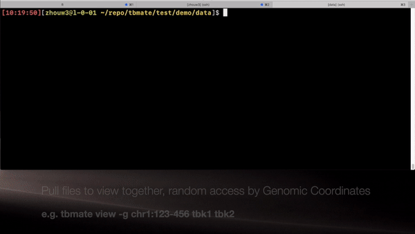

# tbmate: nimble disk storage and access for genomic data

tbmate (TabixMate) works with [Tabix](http://www.htslib.org/doc/tabix.html) - the Swiss-knife tool for random accessing genomic data. However, there are 3 limitations of applying tabix to large genome-wide data sets.

1. Random access is on a per file basis. Splitting and merging data sets are clumsy.
2. Each tabix-ed file (bed, gff etc) must contain a set of genomic coordinates, which creates redundancy in storage.
3. Data is bound to a coordinate system. Changing coordinate system requires data copy and re-indexing.
4. Addressing is opaque.

tbmate is meant to solve/alleviate these challenges by de-coupling the data from the coordinate system.

1. Random accessing can be done across any set of files packed under the same address standard.
2. Coordinates are stored separately from data. Data is rebound to coordinates during IO
3. Data addresses can be re-arranged to allow accessing under a different coordinate system. Therefore, the coordinate system can be switched by swapping address file without copying data.
3. Addresses are stored in plain text. Disk offset can be easily calculated.
4. tbmate supports random disk output

tbmate is currently implemented in C and R. It can easily be extended to other programming languages.

## "Column-wise operation" by file selection.

Each sample is stored in a file. Data sets can be easily assembled by selecting files.

## Switch coordinate without copying data.

